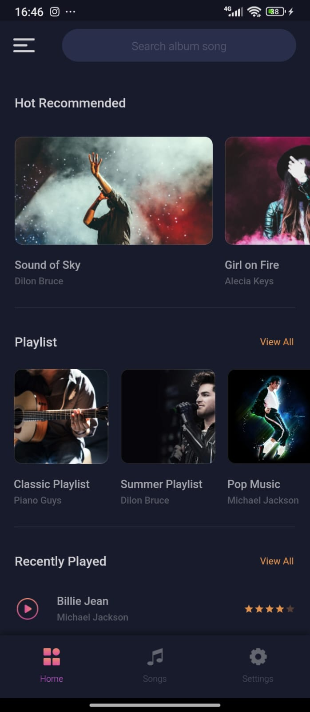
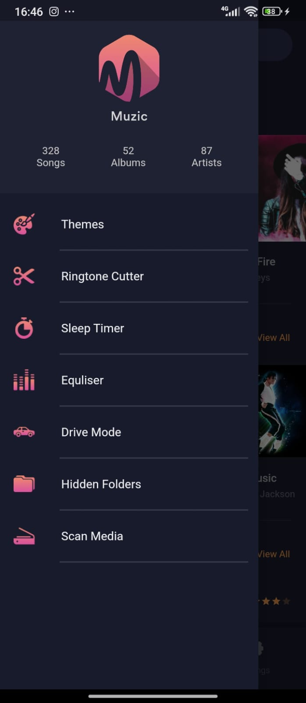
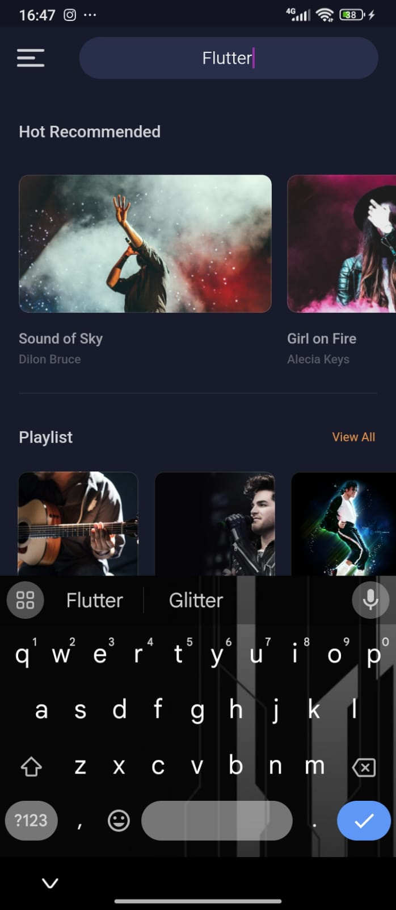
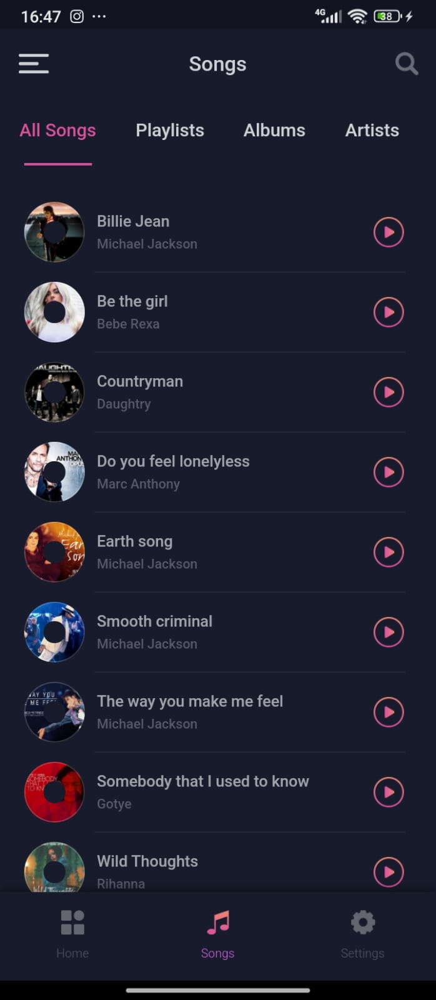
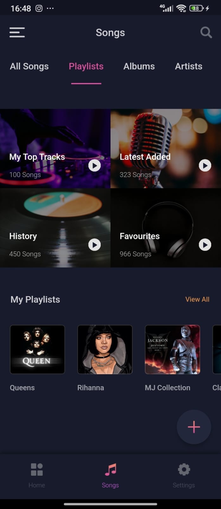
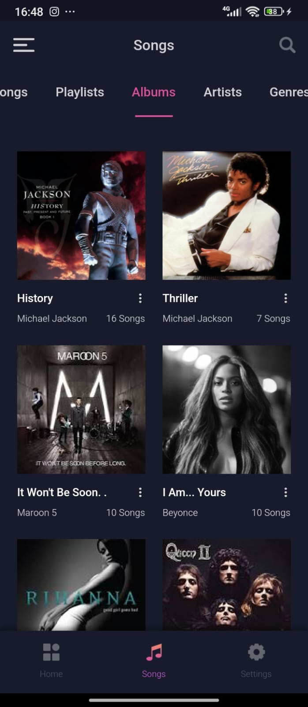
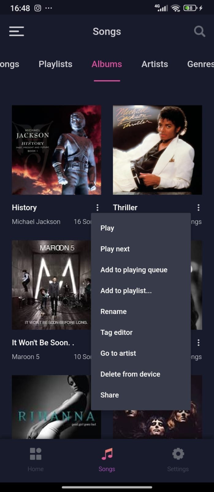
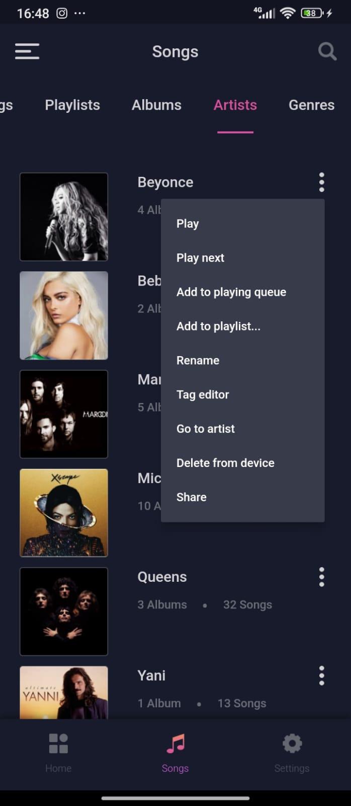
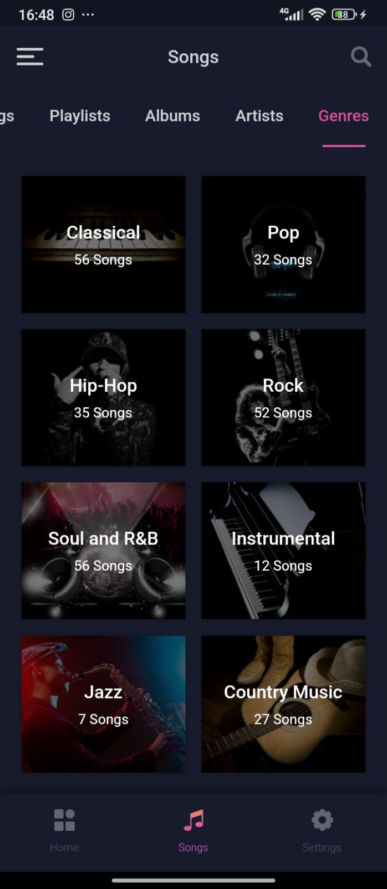
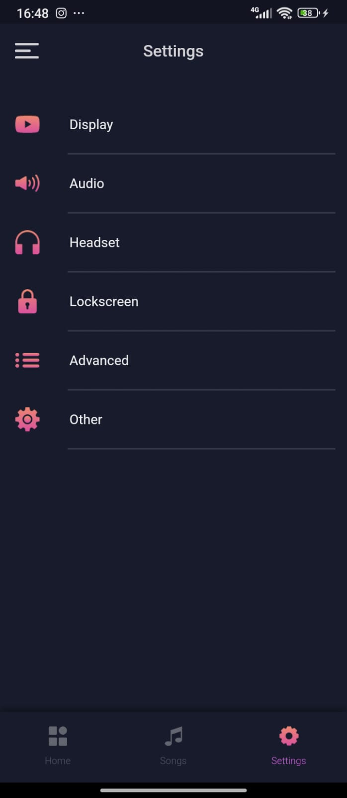

# UI Design

Player de músicas desenvolvido em Flutter com uma aparência simples e elegante, além de contar com uma navegação fácil e bem construída utilizando o pacote [Get](https://pub.dev/packages/get) para administrar a troca de telas e de informações. 

❗❗ O aplicativo foi construído seguindo o design criado por [Akila Weerakoon](https://www.behance.net/gallery/102335049/Muzic-Free-Adobe-XD-UI-Kit).

## Telas construídas

  
  
  
  
  
  
  
  
  
  
  

 
