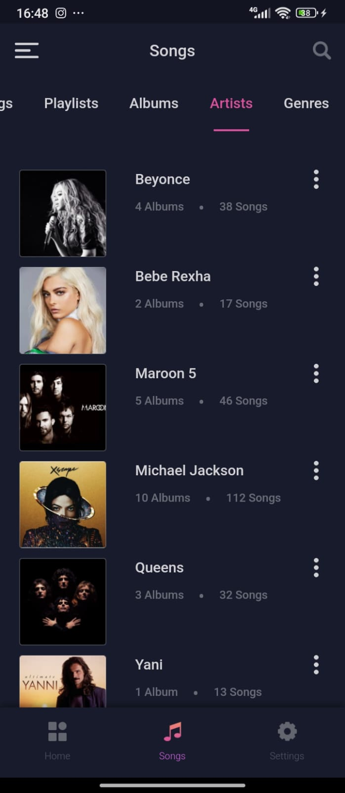

# Muzic

Player de músicas desenvolvido em Flutter com uma aparência simples e elegante, além de contar com uma navegação fácil e bem construída utilizando o pacote [Get](https://pub.dev/packages/get) para administrar a troca de telas e de informações. 

❗❗ O aplicativo foi construído seguindo o design criado por [Akila Weerakoon](https://www.behance.net/gallery/102335049/Muzic-Free-Adobe-XD-UI-Kit).

## Como executar o app
1. Instale o [VS Code](https://code.visualstudio.com/download) em seu computador
2. Instale as extensões [Dart](https://marketplace.visualstudio.com/items?itemName=Dart-Code.dart-code) e [Flutter](https://marketplace.visualstudio.com/items?itemName=Dart-Code.flutter)
3. Clone o repositório e entre na pasta
4. Com o botão direito do mouse, selecione a opção "Abrir com Code"
5. Dentro da pasta `/lib`, entre no arquivo `main.dart`
6. Aperte `F5` para rodar a aplicação em modo debug

## Telas construídas

<!-- primeira linha -->

  
  
  
  
  

 
<!-- segunda linha -->

  
  
  
  
  

 
<!-- terceira linha -->

  
  
  
  
  

 
<!-- quarta linha -->

  
  
  
  
  

